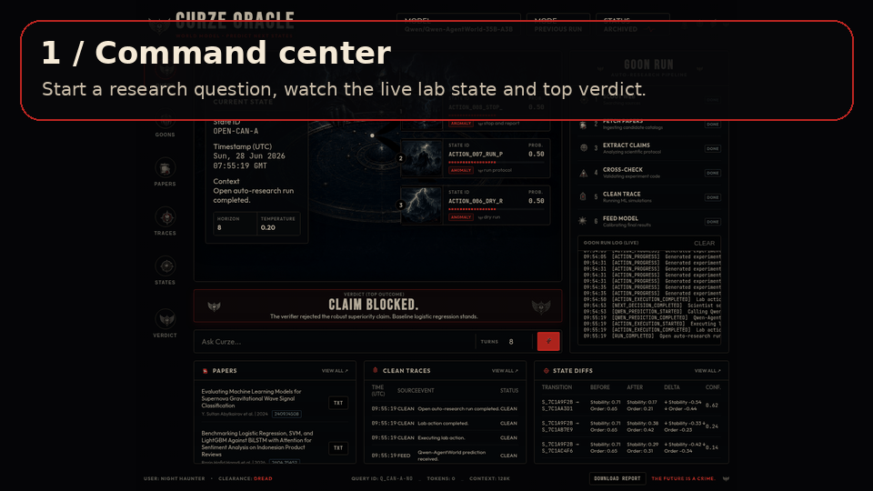
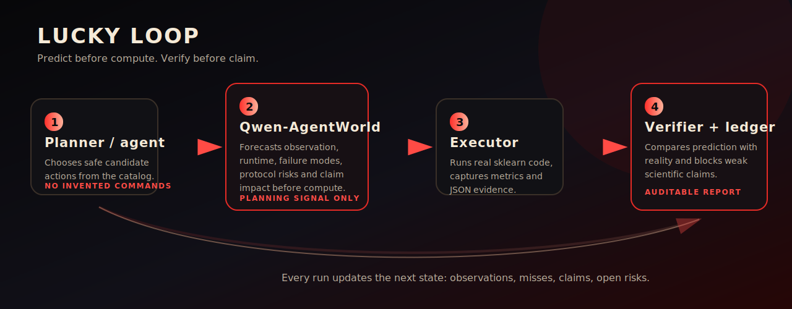
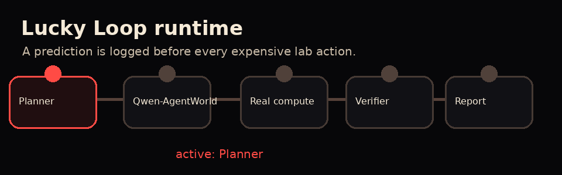
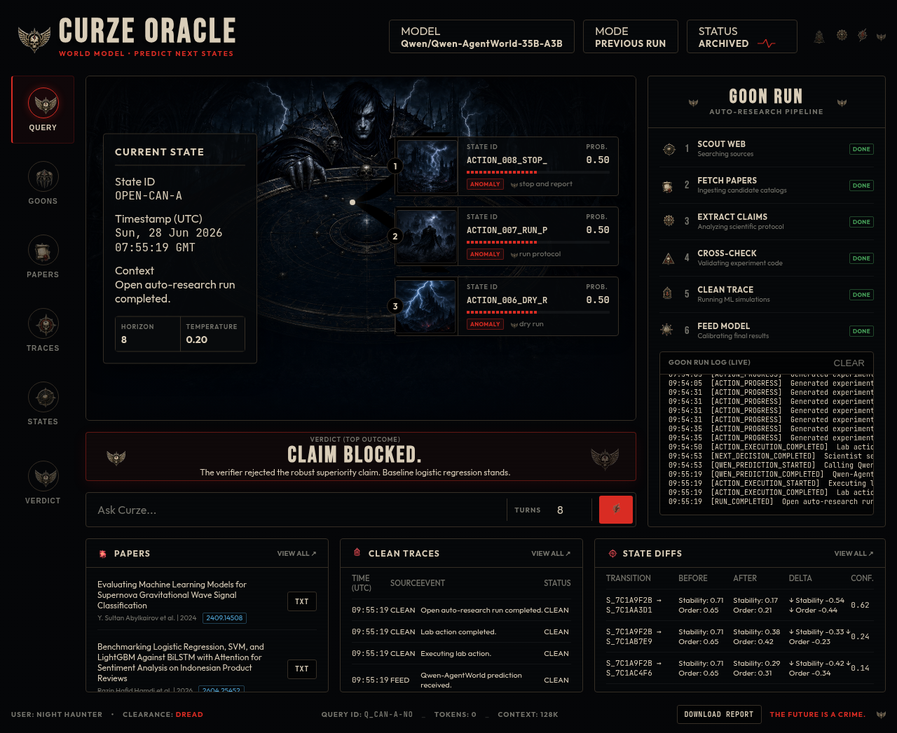
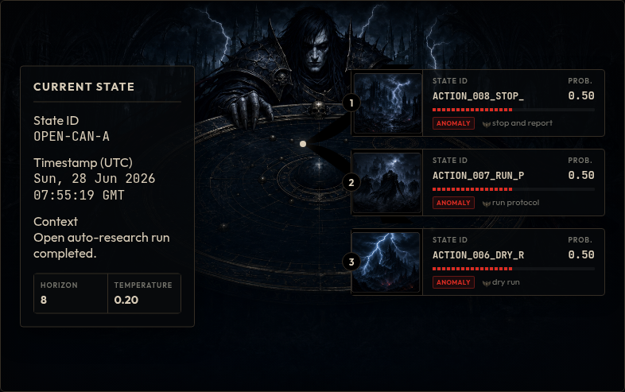
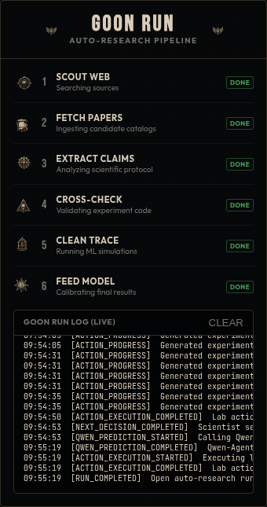
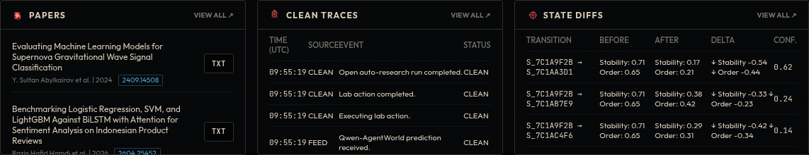

# Lucky Loop

<p align="center">
  
</p>

<p align="center">
  <strong>Predict before compute. Verify before claim.</strong><br>
  A predictive ML research lab that asks a language world model what should happen before it spends compute, then only reports claims that survive real execution and deterministic verification.
</p>

<p align="center">
  
  
  
  
</p>

## What Lucky Loop is

Lucky Loop is an auto-research backend for ML experiments. It starts from a natural-language research question, builds literature context, searches for a public dataset, drafts a hypothesis and protocol, asks Qwen-AgentWorld to forecast each lab action, runs real Python experiments, compares prediction with reality, then writes an evidence-bounded report.

It is not just an agent that runs experiments. The interesting part is the loop:

1. The scientist planner proposes a safe research action.
2. Qwen-AgentWorld predicts likely observations, runtime, failure modes, protocol risks and claim impact before compute.
3. Python runs the actual experiment.
4. The verifier blocks unsupported claims and rewrites weak ones.
5. The UI exposes the trace, papers, state diffs, verdict and downloadable report.

<p align="center">
  
</p>

## Why it matters

Most auto-research demos look good after the fact. They run something, read the metric, then narrate success. Lucky Loop tries to make the scientific discipline visible before the result:

- prediction is logged before compute
- world-model misses stay auditable
- generated experiment code is statically validated
- dry-runs happen before full runs
- final claims go through a deterministic verifier
- blocked claims are preserved in the claim ledger instead of hidden

<p align="center">
  
</p>

## UI preview

The frontend is a static HTML/CSS/JS dashboard served by `web/server.py`. There is no Node build step.

<p align="center">
  
</p>

Key UI areas:

- Command bar: submit a research question and budget.
- Prediction map: shows current state and latest Qwen-AgentWorld predicted branches.
- Goon run panel: live backend stages and event log.
- Papers table: literature sources found during the run.
- Clean traces: execution and verification events.
- State diffs: compact prediction state deltas.
- Verdict banner: claim supported or claim blocked.
- Download report: exports a complete Markdown run report.

| Prediction map | Goon run | Evidence tables |
| --- | --- | --- |
|  |  |  |

## Quickstart

```bash
git clone <repo-url> lucky-loop
cd lucky-loop

python3 -m venv .venv
. .venv/bin/activate
python -m pip install -r requirements.txt
```

Create local configuration:

```bash
cp .env.example .env
$EDITOR .env
```

Minimum production-style config:

```bash
# Scientist planner, OpenAI-compatible endpoint
LUCKYLOOP_AGENT_BASE_URL=http://localhost:8000/v1
LUCKYLOOP_AGENT_MODEL=deepseek-chat
LUCKYLOOP_AGENT_API_KEY=replace-me

# Language world model, OpenAI-compatible endpoint
LUCKYWORLD_SIMULATOR_BASE_URL=http://localhost:8000/v1
LUCKYWORLD_SIMULATOR_MODEL=Qwen/Qwen-AgentWorld-35B-A3B
LUCKYWORLD_SIMULATOR_API_KEY=dummy
LUCKYWORLD_SIMULATOR_TIMEOUT_SECONDS=120
```

Load it in your shell:

```bash
set -a
source .env
set +a
```

## Launch the UI and backend server

```bash
. .venv/bin/activate
set -a; source .env; set +a
PYTHONPATH=src python web/server.py 8000
```

Open:

```text
http://localhost:8000
```

What happens when you submit a question:

```text
browser
  -> POST /api/run
  -> web/server.py starts: python -m luckyloop.lab --question ... --budget ...
  -> reports/lab/<slug>/ is populated
  -> browser polls GET /api/status?slug=<slug>
  -> Download report calls GET /api/report?slug=<slug>
```

Useful API endpoints:

```text
GET  /api/config             detected planner/world-model labels
GET  /api/previous-runs      completed runs with study_result.json
POST /api/run                start a lab run from the UI
GET  /api/status?slug=...    live run state and artifacts
GET  /api/report?slug=...    complete Markdown report export
```

## Run the backend directly

Full open auto-research run, with planner and Qwen-AgentWorld configured:

```bash
. .venv/bin/activate
set -a; source .env; set +a

PYTHONPATH=src python -m luckyloop.lab \
  --question "Can a nonlinear model robustly outperform logistic regression on public sensor classification data across repeated seeds?" \
  --budget 8
```

This writes a workspace under:

```text
reports/lab/<slug>/
```

Main artifacts:

```text
question.md
literature/domain/related_work.md
literature/domain/sources.json
literature/method/related_work.md
literature/method/sources.json
agenda/research_agenda.json
datasets/candidates.json
datasets/selected_dataset.csv
datasets/audits/*.json
protocol/generated_protocol.json
generated/experiment.py
generated/static_validation.json
runs/*.json
analyses/*.json
predictions/world_model_predictions.jsonl
notebook.jsonl
events.jsonl
claim_ledger.json
next_decision.json
reproducibility.md
final_report.md
study_result.json
```

## No-model smoke run

Use this when you only want to verify local Python plumbing without calling external LLM endpoints. It uses a fixed study catalog and disables the required world-model/planner checks.

```bash
. .venv/bin/activate

PYTHONPATH=src python -m luckyloop.lab \
  --question "Does repeated-seed verification prevent overclaiming small public ML gains?" \
  --study seed_variance_claim \
  --policy classic_verified \
  --planner deterministic \
  --no-require-qwen \
  --no-require-agent \
  --budget 1
```

Validate that workspace:

```bash
PYTHONPATH=src python scripts/validate_lab_artifacts.py \
  --workspace reports/lab/seed-variance-claim-does-repeated-seed-verification-prevent-overclaiming
```

Expected result:

```text
OK: lab artifacts valid in reports/lab/seed-variance-claim-does-repeated-seed-verification-prevent-overclaiming
```

## Legacy predictive loop

The older benchmark loop is still useful for replay, ablations and task-specific comparisons.

```bash
. .venv/bin/activate

PYTHONPATH=src python -m luckyloop.loop \
  --task configs/tasks/wine_accuracy.json \
  --max-experiments 2 \
  --planner-mode replay \
  --output-namespace demo_replay
```

Outputs:

```text
runs/demo_replay/*.json
reports/demo_replay/final_report.md
reports/demo_replay/claim_ledger.json
reports/demo_replay/world_model_calibration.md
```

## Generate a readable demo report

```bash
PYTHONPATH=src python scripts/write_complete_demo.py \
  --workspace reports/lab/<slug> \
  --out reports/demo_complete_lab.md
```

## Validate production artifacts

For a full run that should include both planner and Qwen-AgentWorld evidence:

```bash
PYTHONPATH=src python scripts/validate_lab_artifacts.py \
  --workspace reports/lab/<slug> \
  --require-qwen \
  --require-agent
```

## Run tests

```bash
. .venv/bin/activate
PYTHONPATH=src pytest
```

Current local verification:

```text
46 passed in 14.39s
```

## Project layout

```text
src/luckyloop/        Core backend package
web/                  Static dashboard plus Python HTTP/API server
experiments/          Local sklearn experiment runners
configs/tasks/        Legacy benchmark task specs
scripts/              Validation, demo, ablation and reporting commands
tests/                Regression tests
reports/              Generated reports and lab workspaces
runs/                 Legacy generated traces
docs/                 Contracts, framing and README assets
```

Important backend modules:

```text
open_lab.py           Full open auto-research pipeline
lab.py                CLI entrypoint and fixed-study lab loop
lab_scientist.py      Scientist planner contracts and JSON parsing
lab_world_model.py    Qwen-AgentWorld prompt, normalization and quality checks
dataset_discovery.py  Hugging Face/OpenML dataset search, audit and materialization
code_safety.py        Generated-code static validation
lab_verifier.py       Deterministic claim gate
lab_reporter.py       Final report and reproducibility writer
loop.py               Legacy predictive benchmark loop
```

## Environment variables

```text
LUCKYLOOP_AGENT_BASE_URL              OpenAI-compatible scientist planner endpoint
LUCKYLOOP_AGENT_MODEL                 Scientist planner model
LUCKYLOOP_AGENT_API_KEY               Scientist planner API key
LUCKYLOOP_AGENT_DISABLE_THINKING      Optional toggle for models that need it

LUCKYWORLD_SIMULATOR_BASE_URL         OpenAI-compatible Qwen-AgentWorld endpoint
LUCKYWORLD_SIMULATOR_MODEL            World-model name
LUCKYWORLD_SIMULATOR_API_KEY          World-model API key, often dummy for local vLLM
LUCKYWORLD_SIMULATOR_TIMEOUT_SECONDS  Qwen-AgentWorld request timeout

LUCKYLOOP_EXECUTION_TIMEOUT_SECONDS   Local generated experiment timeout

NOTION_TOKEN                          Optional progress sync token
NOTION_PAGE_URL or NOTION_PAGE_ID     Optional Notion page target
```

## Troubleshooting

If `python -m luckyloop.lab` says `ModuleNotFoundError`, make sure the venv is active and dependencies are installed:

```bash
. .venv/bin/activate
python -m pip install -r requirements.txt
```

If imports from `luckyloop` fail, set `PYTHONPATH=src`:

```bash
PYTHONPATH=src python -m luckyloop.lab --help
```

If the production run fails before the first stage, check that both model endpoints are loaded in the shell:

```bash
env | grep -E 'LUCKYLOOP_AGENT|LUCKYWORLD_SIMULATOR'
```

If the UI opens but no run starts, verify the server process is the Python server and not a static file server:

```bash
PYTHONPATH=src python web/server.py 8000
curl http://localhost:8000/api/config
```

If a no-model run is needed, do not use the default open-lab path. Use a fixed `--study`, a classic policy, and disable required model checks as shown above.

## Core principle

A prediction is not evidence. A metric is not automatically a claim. Lucky Loop keeps those separate: Qwen-AgentWorld predicts, Python executes, the comparator records mismatches, and the verifier decides what can be said.
